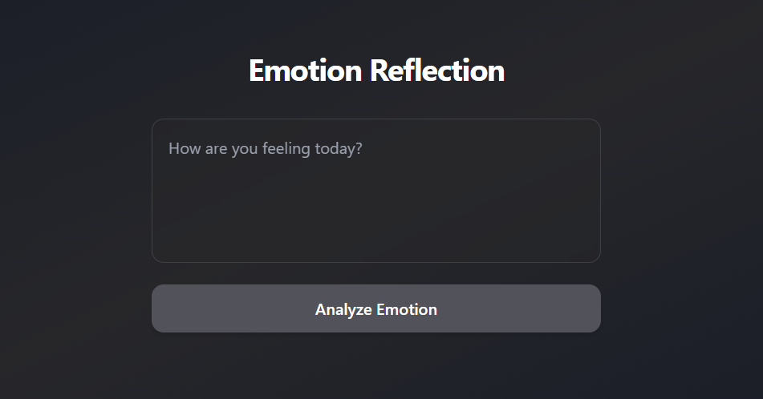
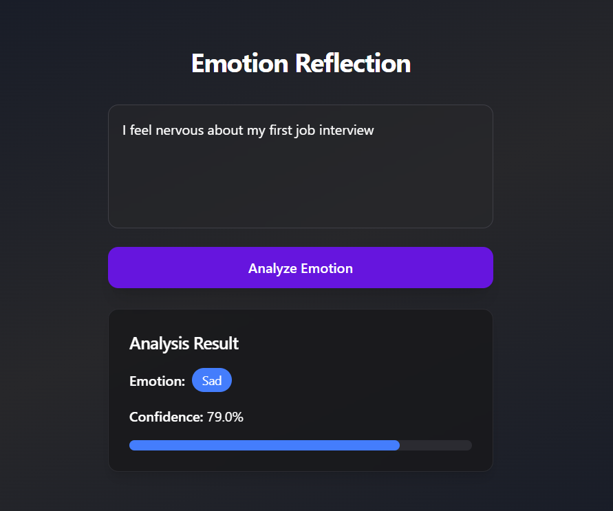

# 🧠 Emotion Reflection Tool

The **Emotion Reflection Tool** is a modern full-stack web application that allows users to reflect on their emotions by typing a short message. The backend analyzes the input and responds with a random emotion and confidence score. Designed with performance, elegance, and simplicity in mind, this tool is perfect for learning or showcasing emotion detection interfaces.

---

## ✨ Features

- 🎯 Simple and intuitive UI
- ⚡ Real-time emotion reflection from user text
- 🎨 Built using React, Tailwind CSS, and TypeScript
- 🚀 FastAPI backend with CORS support
- 🔁 Loading animation and delayed emotion result reveal
- 🌐 Frontend hosted on **Hostinger**, backend on **Render**

---

## 🖼️ Screenshots

### 📝 Emotion Input Form



---

### 🎯 Analyzed Emotion Result



---

## 📁 Folder Structure

```
emotion-reflection/
│
├── backend/                  # FastAPI backend
│   ├── node\_modules/         # (if any)
│   ├── main.py               # API logic
│   └── requirements.txt      # Backend dependencies
│
├── frontend/                 # React + Vite + Tailwind frontend
│   ├── node\_modules/         # Frontend dependencies
│   ├── dist/                 # Production build output
│   ├── src/                  # React component source code
│   │   ├── components/       # EmotionForm + EmotionResult
│   │   ├── types/            # TypeScript types
│   │   ├── App.tsx           # Main app entry
│   │   ├── main.tsx          # React DOM render entry
│   │   └── index.ts          # TS entry
│   ├── index.html            # HTML entry point
│   ├── package.json          # NPM dependencies and scripts
│   ├── vite.config.ts        # Vite configuration
│   ├── tsconfig\*.json        # TypeScript configs
│   ├── .gitignore            # Git ignored files
│   └── eslint.config.js      # ESLint rules
│
├── screenshots/              # UI Screenshots for README
│   ├── form.png
│   └── result.png
│
└── README.md                 # Project documentation

```

---

## 🚀 Live Deployment

- 🌐 **Frontend**: [https://emotion-reflection-tool.lancway.com](https://emotion-reflection-tool.lancway.com)
- 🔗 **Backend API**: [https://backend-34pn.onrender.com/analyze](https://backend-34pn.onrender.com/analyze)

---

## 🧪 Running Locally

### 🔧 Backend Setup (FastAPI)

> Prerequisite: Python 3.11+

```bash
cd backend
pip install -r requirements.txt
uvicorn main:app --reload
```

The API will be available at `http://localhost:8000/analyze`

### 💻 Frontend Setup (Vite + React)

> Prerequisite: Node.js (v16+ recommended)

```bash
cd frontend
npm install
npm run dev
```

The frontend will run at `http://localhost:5173`

---

## 🌐 Deployment Overview

### Frontend (Hostinger)

1. Build the production app:

   ```bash
   npm run build
   ```

2. Upload the contents of `frontend/dist/` to your Hostinger public HTML folder.

### Backend (Render)

* Deploy your `main.py` FastAPI app via [Render](https://render.com).
* Use a **Web Service** with Python and `requirements.txt`.
* Set the CORS in `main.py`:

```python
app.add_middleware(
    CORSMiddleware,
    allow_origins=["https://emotion-reflection-tool.lancway.com"],
    allow_credentials=True,
    allow_methods=["*"],
    allow_headers=["*"],
)
```

---

## 📦 API Reference

### `POST /analyze`

#### Request

```json
{
  "text": "I feel great today!"
}
```

#### Response

```json
{
  "emotion": "Happy",
  "confidence": 0.88
}
```

---

## 📬 Contact

**Ritik Kumar**
Frontend Developer & Project Owner
📧 Email: [ritikrk008@gmail.com](mailto:ritikrk008@gmail.com)
📱 Phone: +91 9693895842

---

## 🤝 Credits

Built and Deployed by **Ritik Kumar** using React, FastAPI, Tailwind CSS, Hostinger, and Render.
